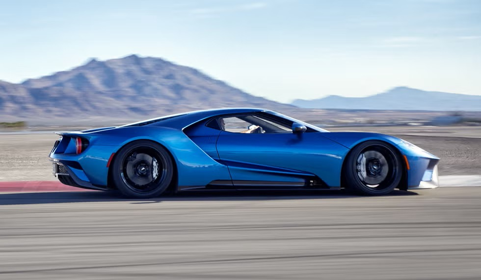
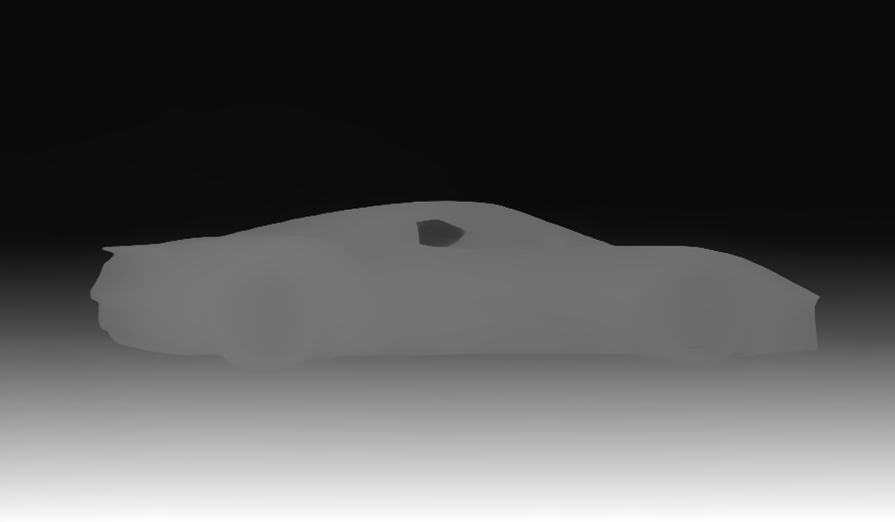
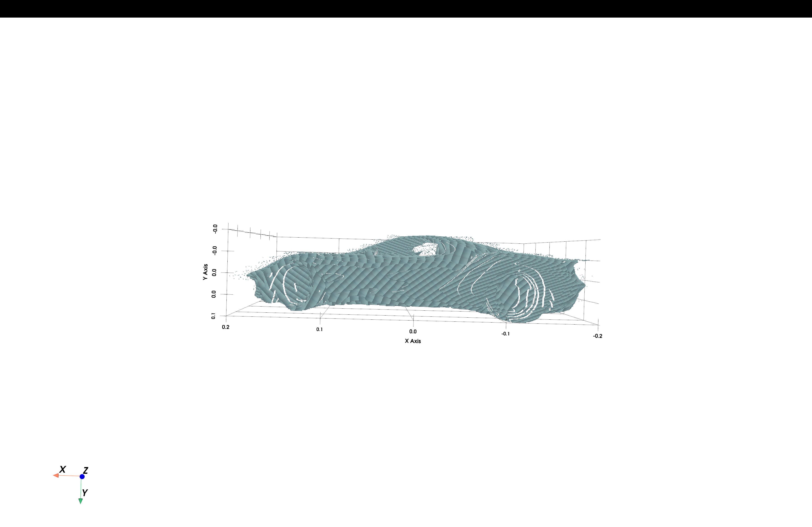

# 🚗 AutoMesh AI

Engineering-grade AI system for reconstructing 3D vehicle models
from blueprint images and real-world photographs.

AutoMesh AI is an end-to-end Computer Vision and 3D Reconstruction project that transforms vehicle images into interactive 3D point clouds.

The project combines modern deep learning models with geometric reconstruction techniques to build a modular reconstruction pipeline capable of:

- Vehicle Segmentation
- Monocular Depth Estimation
- Point Cloud Generation
- PLY Export
- Interactive 3D Visualization

The long-term objective is to evolve AutoMesh AI into an engineering-grade multi-view vehicle reconstruction system capable of generating high-quality 3D meshes suitable for CAD, simulation, and aerodynamic analysis.

## ✨ Features

### Current Features

- [x] Vehicle segmentation using YOLOv8 Segmentation
- [x] Monocular depth estimation using Depth Anything V2
- [x] Depth map normalization and preprocessing
- [x] Vehicle mask extraction
- [x] Point cloud generation from depth maps
- [x] ASCII PLY point cloud export
- [x] Interactive 3D point cloud visualization using PyVista
- [x] Modular reconstruction pipeline
- [x] End-to-end reconstruction with a single command

### Planned Features

- [ ] Multi-view vehicle reconstruction
- [ ] Point cloud fusion
- [ ] Mesh reconstruction
- [ ] Mesh refinement
- [ ] STL export
- [ ] OBJ export
- [ ] Texture mapping
- [ ] Engineering-grade vehicle reconstruction
- [ ] AeroVision AI integration

## 🔄 Reconstruction Pipeline

AutoMesh AI follows a modular end-to-end reconstruction pipeline that transforms a single vehicle image into an interactive 3D point cloud.

```text
                    Vehicle Image
                          │
                          ▼
              YOLOv8 Vehicle Segmentation
                          │
                          ▼
               Vehicle Mask & Cutout
                          │
                          ▼
         Depth Anything V2 Depth Estimation
                          │
                          ▼
                    Depth Map
                          │
                          ▼
              Point Cloud Generation
                          │
                          ▼
                PLY Point Cloud Export
                          │
                          ▼
         Interactive 3D Visualization
```

Each stage of the pipeline is implemented as an independent module, making the reconstruction process reusable, maintainable, and easy to extend.

Current implementation focuses on single-image reconstruction. Future versions will introduce multi-view fusion, mesh reconstruction, and engineering-grade vehicle modeling.

## 🏗 Project Architecture

The project follows a modular architecture where each stage of the reconstruction pipeline is implemented independently.

```text
src/
│
├── segmentation/
│   └── Vehicle segmentation using YOLOv8
│
├── depth/
│   └── Monocular depth estimation
│
├── pointcloud/
│   ├── Point cloud generation
│   └── Point cloud visualization
│
├── pipeline/
│   └── End-to-end reconstruction pipeline
│
└── src/
    │
    ├── segmentation/
    ├── depth/
    ├── pointcloud/
    ├── pipeline/
```

Each module has a single responsibility and exposes a reusable interface.

This architecture makes the project easy to maintain while allowing future extensions such as:

- Multi-view reconstruction
- Point cloud fusion
- Mesh reconstruction
- STL / OBJ export
- AeroVision AI integration

The reconstruction pipeline orchestrates these modules while keeping their implementations independent.

## 🚀 Installation

Clone the repository:

```bash
git clone https://github.com/sidshekhawat/AutoMesh-AI.git
```

Navigate to the project directory:

```bash
cd AutoMesh-AI
```

Create a virtual environment:

```bash
python -m venv venv
```

Activate the virtual environment:

**Windows**

```bash
venv\Scripts\activate
```

**macOS / Linux**

```bash
source venv/bin/activate
```

Install the required dependencies:

```bash
pip install -r requirements.txt
```

## ▶️ Usage

Run the complete end-to-end reconstruction pipeline:

```bash
python -m src.pipeline.reconstruct
```

The pipeline performs the following steps automatically:

1. Vehicle segmentation
2. Depth estimation
3. Depth map generation
4. Point cloud generation
5. PLY export
6. Interactive 3D visualization

### Output Files

After execution, AutoMesh AI generates:

```text
outputs/

├── masks/
│   └── vehicle_mask.png
│
├── cutouts/
│   └── vehicle_cutout.png
│
├── depth/
│   └── depth_map.png
│
└── pointcloud/
    └── vehicle_pointcloud.ply
```

## 📊 Reconstruction Results

The following images demonstrate the current single-view reconstruction pipeline.

| Input Image | Depth Map |
|-------------|-----------|
|  |  |

### Interactive Point Cloud



Current reconstruction pipeline successfully generates an interactive 3D point cloud from a single vehicle image.

Future versions will extend this pipeline to multi-view reconstruction, mesh generation, and engineering-grade vehicle models.

## 🗺️ Development Roadmap

### ✅ V1 — Blueprint Reconstruction

- [x] Blueprint view extraction
- [x] Vehicle silhouette generation
- [x] Visual hull reconstruction
- [x] Marching Cubes mesh generation
- [x] High-resolution voxel reconstruction

---

### ✅ V2.0–V2.4 — Photo Reconstruction

- [x] Vehicle segmentation
- [x] Monocular depth estimation
- [x] Point cloud generation
- [x] PLY export
- [x] Interactive point cloud visualization
- [x] Modular reconstruction pipeline

---

### 🚧 V2.5 — Multi-View Reconstruction

- [ ] Front, rear, left, and right image support
- [ ] Multi-view point cloud generation
- [ ] Point cloud alignment
- [ ] Point cloud fusion

---

### 🔬 V3 — Mesh Reconstruction

- [ ] Surface reconstruction
- [ ] Mesh refinement
- [ ] Mesh smoothing
- [ ] STL export
- [ ] OBJ export

---

### 🚀 V4 — Engineering-Grade Reconstruction

- [ ] Vehicle texture reconstruction
- [ ] Dimension estimation
- [ ] Engineering-quality meshes
- [ ] CAD-ready exports

---

### 🌬️ V5 — AeroVision AI Integration

- [ ] Aerodynamic analysis
- [ ] Drag estimation
- [ ] Lift estimation
- [ ] CFD-ready geometry
- [ ] Design optimization

## 🛠️ Tech Stack

| Category | Technology |
|----------|------------|
| Language | Python |
| Deep Learning | PyTorch |
| Object Segmentation | YOLOv8 Segmentation |
| Depth Estimation | Depth Anything V2 |
| Computer Vision | OpenCV |
| Numerical Computing | NumPy |
| 3D Visualization | PyVista |
| AI Framework | Hugging Face Transformers |
| Point Cloud Format | ASCII PLY |
| Version Control | Git & GitHub |

## 🔮 Future Work

Future development will focus on:

- Multi-view vehicle reconstruction
- Point cloud fusion and alignment
- Surface mesh reconstruction
- Mesh refinement and optimization
- STL and OBJ export
- Texture reconstruction
- Vehicle dimension estimation
- Engineering-grade 3D models
- Aerodynamic analysis through AeroVision AI
- CFD-ready vehicle geometry

## 📄 License

This project is released under the MIT License.

See the LICENSE file for details.

---

⭐ If you find this project interesting, consider giving the repository a star.

AutoMesh AI is an actively evolving Computer Vision and 3D Reconstruction project. Contributions, suggestions, and feedback are always welcome.